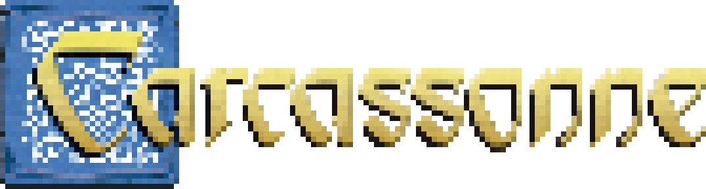
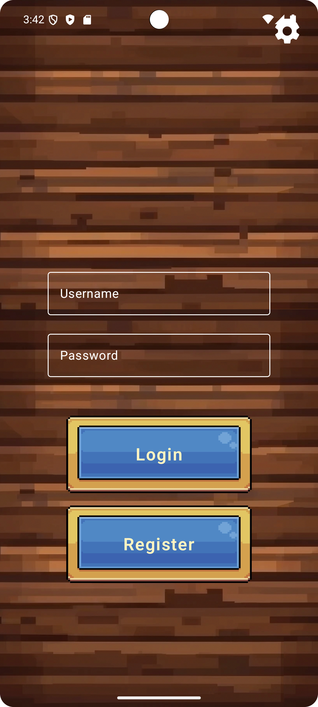
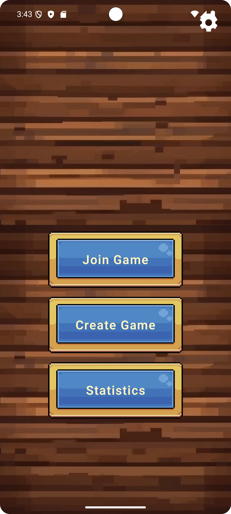
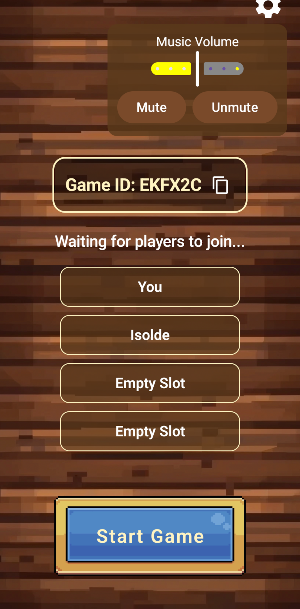
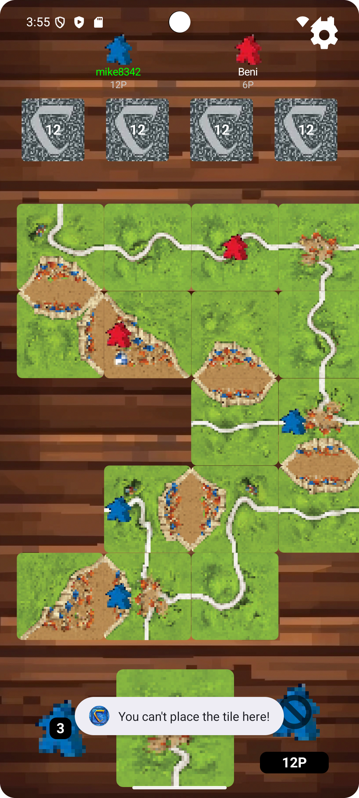
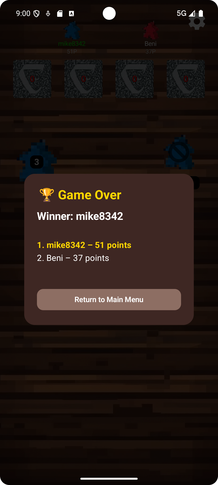

# 📘 Projekt: Carcassonne für Android

## 📑 Inhaltsverzeichnis

- [1. Game Specification](#1-game-specification)
  - [1.1 Spielübersicht](#11-spielübersicht)
  - [1.2 Spiellogik](#12-spiellogik)
  - [1.3 Systemdesign](#13-systemdesign)
  - [1.4 UI/UX-Anforderungen](#14-uiux-anforderungen)
  - [1.5 Spielzug-Ablauf](#15-spielzug-ablauf)
  - [1.6 Spielende](#16-spielende)
- [2. App-UI - Screenshots](#2-app-ui---screenshots)
- [3. Weiterführende Links](#3-weiterführende-links)

---

## 1. Game Specification

### 1.1 Spielübersicht

**Titel:** Carcassonne für Android  
**Plattform:** Android (Kotlin / Jetpack Compose)  
**Backend:** Kotlin (Spring Boot)  
**Datenbank:** PostgreSQL  
**Spielerzahl:** 2 bis 4 (ausschließlich Mehrspieler‑Modus)

#### Projektziel:
Dieses Projekt realisiert eine digitale Mehrspieler‑Version des Brettspiels Carcassonne:

- Landschaftskarten abwechselnd legen
- Städte, Straßen und Klöster bauen
- Meeples setzen, um Punkte zu sammeln
- Spielende, wenn alle Karten gelegt sind - höchste Punktzahl gewinnt

Umfang:

- Interaktive Android‑UI mit Zoom‑ und Scroll-Gesten
- Echtzeit-Mehrspieler via WebSocket (kein Bot)
- Synchronisierung des Spielstatus zwischen allen Spielern
- Sicheres Backend für Spielregeln, Punktevergabe und Persistenz
- Persistente Speicherung von Spieler- und Spieldaten

---

### 1.2 Spiellogik

#### ▶️ Kartenplatzierung

**Was Spieler tun:**

- Aktiver Spieler zieht eine zufällige Karte aus dem Stapel
- Karte kann um 0°, 90°, 180° oder 270° gedreht werden
- Die Karte muss an mindestens eine bestehende Karte angrenzen - alle Kanten müssen zueinander passen (z.B. Stadt an Stadt)
- Kann keine gültige Platzierung gefunden werden, wird die Karte zurück unter den Stapel gelegt und eine neue Karte gezogen

**Technische Hinweise:**

- Kartenstapel wird einmalig mit seed‑basierter Zufallslogik erzeugt.
- Spielfeld als dynamisches Koordinatensystem (x,y) implementiert
- Karten werden in Map-Struktur gespeichert und können in alle Richtungen erweitert werden

#### ▶️ Meeple-Platzierung

**Was Spieler tun:**

- Nach dem Platzieren einer Karte kann der Spieler einen Meeple auf ein Segment (=Feature) der platzierten Karte setzen
- Funktionen des Meeples: Ritter (Stadt), Wegelagerer (Straße) oder Mönch (Kloster)
- Platzierung eines Meeples auf einem Segment ist nur erlaubt, wenn das entsprechende Feature auf dem gesamten verbundenen Teilfeld noch frei ist

**Technische Hinweise:**

- Jeder Spieler verfügt über 7 Meeples
- Tiefensuche (Depth‑First Search, DFS) prüft Besetzung

#### ▶️ Speicherung der Karteninstanz

- Karten-ID
- Platzierung im Spielfeld (Koordinaten)
- Rotation
- Spieler, der sie gelegt hat
- Info ob Meeple gelegt wurde
- Features der Karte in allen Himmelsrichtungen & der Mitte (Stadt, Feld, Straße, Kloster)

#### ▶️ Punktevergabe

**Serverseitige Punktewertung bei vollständigen Features:**

- **Stadt (fertig):** 2 Punkte pro Karte, +2 pro Wappen
- **Straße (fertig):** 1 Punkt pro Karte
- **Kloster (vollständig umbaut):** 9 Punkte (inkl. 8 umliegende Karten)

**Technische Hinweise:**

- Punkteberechnung erfolgt nach jedem Zug
- Meeples kehren nach der Wertung in den Vorrat des Spielers zurück

---

### 1.3 Systemdesign

#### ▶️ Server (Spring Boot)

**Aufgaben des Backends:**

- Spielräume erstellen, beitreten und starten
- Spielstatus speichern und validieren
- Spielregeln und Punktevergabe durchsetzen
- Kommunikation mit Frontend via REST-API & WebSocket
- Spielerprofilverwaltung (ID, Username, Passwort, Highscore, etc.)
- Authentifizierung aller Nutzeraktionen mittels JSON Web Tokens
- Absicherung aller Endpunkte außer Login und Registrierung durch JWT‑Prüfung

#### ▶️ Datenbank (PostgreSQL)

**Anforderungen:**

- Persistente Spielerspeicherung
- Spielverlauf und Statistiken

**Tabellen (per Spring JPA generiert):**
- `users`: Spieler mit ID, Username, Passwort (gehasht) und Highscore
- `games`: Spiele mit ID, Erstellungszeitpunkt, Status, Spielcode und Gewinner

#### ▶️ Frontend (Jetpack Compose)

**Funktionen:**

- Authentifizierung, Lobby betreten, Spiel starten oder beitreten per Game-ID
- Spielerübersicht inklusive aktueller Punkte & aktuellem Spieler in Echtzeit
- Scroll- und zoombares Spielfeld
- Karten ziehen, rotieren und platzieren
- Meeple setzen oder ohne Platzierung den Zug beenden
- Betrugsmodus: Cheat‑Funktion und Expose!‑Button zum Aufdecken von Betrug - mit Bestrafung bei Missbrauch
- Animierter Endbildschirm mit finalem Punktestand

**Technische Features:**

- Dynamisches Tile-Grid für Spielfeld
- WebSocket-Verbindungen für Synchronisierung
- Buttons für Rotation (durch Klick auf vergrößerte, zu platzierende Karte), Meeple‑Platzierung, Zug beenden
- Zoom- und Scroll-Gesten für Kartenansicht
- Toast‑Meldungen an relevante Spieler für jegliche Aktionen im Spiel

---

### 1.4 UI/UX-Anforderungen

**Spielbildschirm:**

**Oben:**

- Aktiver Spieler hervorgehoben
- Punktetafel mit Farbe, Namen und Punktzahl aller Spieler
- Restliche Karten im Deck

**Mitte:**

- Dynamisches Spielfeld (scroll-/zoombar)
- Platzierung von Karte und Meeple per Tap

**Unten:**

- Meeple-Platzierungs-Indikator, inkl. Anzeige der noch verfügbaren Meeples
- Vergrößerte Ansicht der gezogenen Karte (nur für aktiven Spieler)
- Buttons: 🔁 Rotieren als Vorbereitung des Platzierens per Tippen
- Für die nicht aktiven Spieler: "Expose!"-Button, zum Entlarven eines Cheaters
- "Skip-Meeple"-Button zum Beenden der Spielrunde ohne Meeple-Platzierung
- Eigene Punktezahl des Spielers

**Endansicht:**

- Finaler Punktestand aller Spieler mit Hervorhebung des Gewinners
- Button zurück zum Main Screen

---

### 1.5 Spielzug-Ablauf

**Ablauf eines Zugs:**

1. Server sendet eine zufällige Karte an aktiven Spieler
2. Spieler rotiert und platziert die Karte
3. Optional: Meeple platzieren
4. Server prüft Platzierung und wertet abgeschlossene Features
5. WebSocket-Update an alle Spieler
6. Nächster Spieler ist an der Reihe

**Frontend:**

- Eingaben für nicht-aktive Spieler blockieren und entsprechende Toasts senden
- Nur gültige Aktionen erlauben, bei fehlerhaften Klicks entsprechende Toasts senden

**Server:**

- Validierung aller Eingaben
- Änderungen persistieren

---

### 1.6 Spielende

Nach dem letzten Zug berechnet der Server das Endergebnis, zeigt den Sieger und alle Punktestände an und bietet die Rückkehr zur Lobby an.

**---**

## 2. App-UI - Screenshots

Die folgenden Screenshots zeigen den finalen Stand der Benutzeroberfläche in der App:

### Landing Page
Startbildschirm der App

### Authentication Screen
Login/Registrierung zur Nutzerverwaltung

### Main Screen
Auswahl: Neues Spiel erstellen, bestehendem Spiel beitreten, Statistiken ansehen

### Game Lobby
Übersicht der beigetretenen Spieler und Button um das Spiel zu starten

### Gameplay Screen
Spielbildschirm mit Karten- und Meepleplatzierung sowie Spielinformationen und Toastnachrichten

### End of Game Screen
Endpunktestand aller Spieler, mit Hervorhebung des Sieger und Möglichkeit zum Menü zurückzukehren

**---**

## 3. Weiterführende Links

- 🌐 **Projekthomepage auf itch.io**:  
  👉 [https://j0klar.itch.io/pixel-carcassonne](https://j0klar.itch.io/pixel-carcassonne)
> Hier findest du die veröffentlichte Version der App, weitere Infos und Screenshots des Spiels, welches du auch gerne bewerten kannst!

- 🌐 **Homepage des Original-Boardgames**:  
  👉 [https://www.hans-im-glueck.de/carcassonne-familie/](https://www.hans-im-glueck.de/carcassonne-familie/)