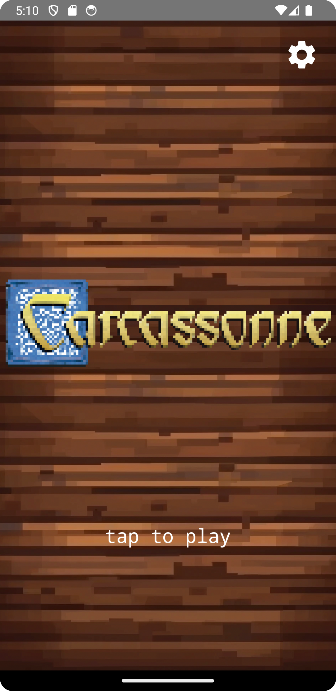
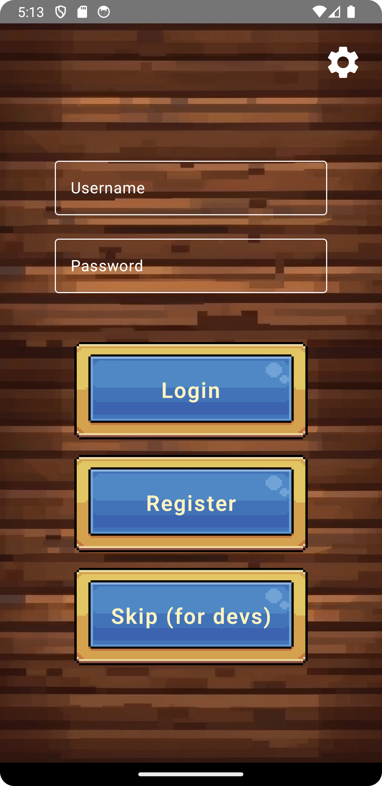
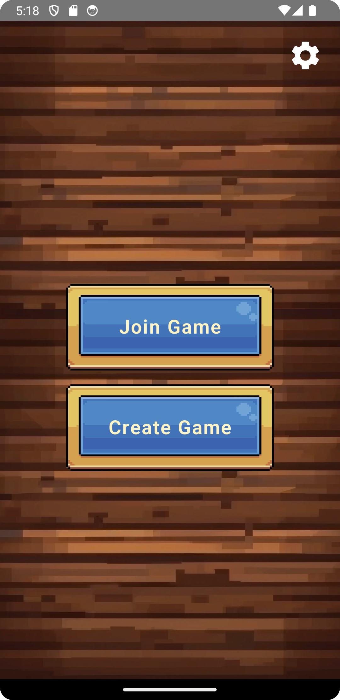
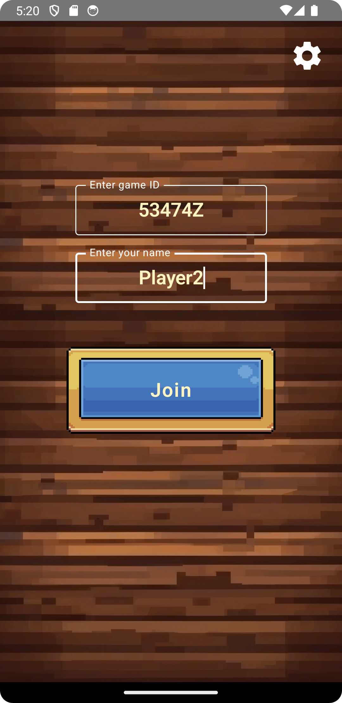
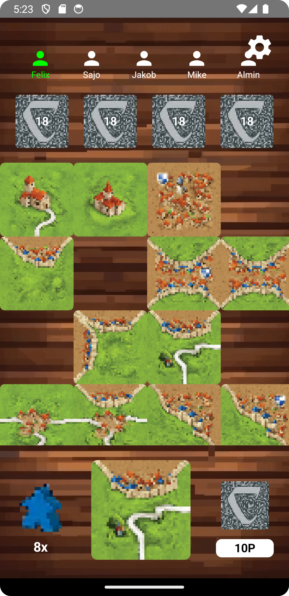

 # 📘 Projekt: Carcassonne Android

## 📑 Inhaltsverzeichnis

- [1. Game Specification](#1-game-specification)
  - [1.1 Spielübersicht](#11-spielübersicht)
  - [1.2 Spiellogik](#12-spiellogik)
  - [1.3 Systemdesign](#13-systemdesign)
  - [1.4 UIUX Anforderungen](#14-uiux-anforderungen)
  - [1.5 Spielzug-Ablauf](#15-spielzug-ablauf)
  - [1.6 Endabrechnung](#16-endabrechnung)
- [2. GUI Sketches](#2-gui-sketches)

---

## 1. Game Specification

### 1.1 Spielübersicht

**Titel:** Carcassonne Android  
**Plattform:** Android (Kotlin mit Jetpack Compose)  
**Backend:** Kotlin Spring Boot  
**Datenbank:** PostgreSQL  
**Multiplayer:** Nur Mehrspieler (2 – 4 Spieler)

#### Projektziel:
Wir entwickeln eine digitale, mehrspielerfähige Version des Brettspiels Carcassonne, bei der die Spieler abwechselnd Landschaftskarten legen, Städte, Straßen und Klöster bauen und Meeples auf Felder setzen, um Punkte zu sammeln. Das Spiel endet, wenn alle Karten gelegt sind. Der Spieler mit den meisten Punkten gewinnt.

Dieses Projekt umfasst:

- Eine voll interaktive Android-Benutzeroberfläche
- Echtzeit-Mehrspielerfunktion (kein Bot)
- Synchronisierung des Spielstatus zwischen Spielern
- Sicheres Backend für Spielregeln, Punktevergabe und Datenspeicherung
- Persistente Speicherung von Spieler- und Spieldaten

---

### 1.2 Spiellogik

#### ▶️ Kartenplatzierung

**Was Spieler tun:**

- In ihrem Zug ziehen Spieler eine zufällige Karte aus dem Stapel.
- Sie können die Karte rotieren (0°, 90°, 180°, 270°).
- Die Karte muss an eine bestehende Karte angrenzen und alle Kanten müssen passend sein (z.B. Stadt an Stadt).
- Wenn die Karte nicht gelegt werden kann, wird sie aus dem Spiel genommen und der Spieler darf eine neue Karte ziehen.

**Technische Hinweise:**

- Der Kartenstapel sollte im Vorfeld definiert und mit Seed-basierter Zufallslogik generiert werden.
- Das Spielfeld wird als dynamisches Koordinatensystem (x, y) verwaltet.
- Karten werden in einer Map-Struktur gespeichert und können in alle Richtungen erweitert werden.

#### ▶️ Meeple-Platzierung

**Was Spieler tun:**

- Nach dem Platzieren einer Karte kann der Spieler optional einen Meeple auf ein Segment der neu platzierten Karte setzen.
- Mögliche Funktionen des Meeples: Ritter (Stadt), Wegelagerer (Straße) oder Mönch (Kloster).
- Ein Funktion darf nicht bereits durch einen Meeple (auch eines anderen Spielers) besetzt sein.

**Technische Hinweise:**

- Jeder Spieler startet mit 7 Meeples.
- Vor Platzierung muss geprüft werden, ob das gesamte Feature schon besetzt ist (per DFS - Depth-First Search - Tiefensuche).

#### ▶️ Speicherung der Karteninstanz

- Karten-ID
- Platzierung in Map (Koordinaten)
- Rotation
- Spieler der sie gelegt hat
- Info ob Meeple gelegt wurde
- Falls ja, wohin (Segment – z.B. Stadt, Straße, Kloster und falls es mehrere Möglichkeiten gibt: Nord, Ost, West, Süd – z. B. nötig bei Karte Straßenkreuzung)

#### ▶️ Punktevergabe

**Punktevergabe erfolgt:**

- Während des Spiels bei vollständigen Features (fertige Städte, Straßen, vollständig umbaute Kloster)
- Am Spielende für unvollständige Features und Felder

##### Punktelogik während des Spiels:

- **Stadt (vollständig):** 2 Punkte pro Karte, +2 pro Wappen
- **Straße (vollständig):** 1 Punkt pro Karte
- **Kloster (vollständig):** 9 Punkte (inkl. 8 umliegende Karten)

**Technische Hinweise:**

- Punkteberechnung erfolgt serverseitig nach jedem Zug.
- Punkte werden in der GamePlayer-Tabelle gespeichert.
- Meeples kehren zurück, sobald ein Feature gewertet wurde.

##### Punktelogik am Spielende (Endwertung)

Nach der letzten Runde, wenn der letzte Spieler seine Karte gelegt und ggf. einen Meeple gesetzt hat, erfolgt die Endwertung. Dabei werden alle nicht vollständig abgeschlossenen Features gewertet.

**Nicht abgeschlossene Features:**

- **Städte:**  
  1 Punkt pro Kartenstück  
  +1 Punkt pro Wappen  
  Beispiel: Stadt mit 3 Karten, 1 Wappen → 4 Punkte

- **Straßen:**  
  1 Punkt pro Kartenstück  
  Beispiel: Unvollständige Straße mit 5 Karten → 5 Punkte

- **Klöster:**  
  1 Punkt pro angrenzender Karte  
  +1 Punkt für das Kloster selbst  
  Beispiel: Kloster mit 5 angrenzenden Karten → 6 Punkte

---

### 1.3 Systemdesign

#### ▶️ Backend (Spring Boot)

**Aufgaben des Backends:**

- Spielräume erstellen, beitreten, starten
- Spielstatus speichern und validieren
- Spielregeln und Punktevergabe durchsetzen
- Kommunikation mit Frontend via REST & WebSocket
- Nutzeridentifikation (optional mit Profilen)

**Wichtige Entitäten:**

- **User**: Spielerprofil mit ID, Username, Password und Highscore
- **Game**: Spielsession mit GameCode, Status und Gewinner

#### ▶️ Datenbank (PostgreSQL)

**Anforderungen:**

- Persistente Spielerspeicherung
- Wiederaufnahme unterbrochener Spiele
- Spielverlauf und Statistiken

**Tabellen (per Spring JPA generiert):**
- `users`: Spieler mit ID, Name und Highscore (Passwort wird gehasht gespeichert)
- `games`: Spiele mit Spielcode, Status, Gewinner und Erstellungszeitpunkt

#### ▶️ Frontend (Jetpack Compose)

**Funktionen:**

- Lobby betreten, Spiel starten oder beitreten per Game-ID
- Kartenplatzierung mit Rotation
- Meeple-Auswahlfeld
- Anzeige der Punkte in Echtzeit
- Scroll- und zoombares Spielfeld
- Endansicht mit Ergebnissen

**Technische Features:**

- Dynamisches Grid oder Canvas für Spielfeld
- WebSocket-Verbindung zur Synchronisierung
- UI mit Buttons für Rotation, Meeples, Bestätigen
- Zoom- und Scroll-Gesten für Kartenansicht

---

### 1.4 UIUX Anforderungen

**Spielbildschirm:**

**Oberer Bereich:**

- Aktueller Spieler hervorgehoben
- Punktetafel mit Namen, Punkte, verfügbare Meeples

**Mittelteil:**

- Dynamisches Spielfeld (scroll-/zoombar)
- Platzierung von Karte und Meeple per Tippen, Rotieren und Drag&Drop

**Unterer Bereich:**

- Meeple inkl. Anzahl des aktuellen Spielers
- Neue Karte etwas größer dargestellt
- 🔁 Drehen per Tippen
- ✅ Platzierung bestätigen

**Endansicht:**

- Finaler Punktestand
- Optionen: Neues Spiel / Zurück zur Lobby

---

### 1.5 Spielzug-Ablauf

**Ablauf eines Zugs:**

1. Server sendet eine zufällige Karte an den aktiven Spieler
2. Spieler rotiert und platziert die Karte
3. Optional: Meeple platzieren
4. Server prüft Platzierung und wertet Features
5. WebSocket-Update an alle Spieler
6. Nächster Spieler ist an der Reihe

**Frontend:**

- Eingaben für nicht-aktive Spieler blockieren
- Nur gültige Aktionen erlauben

**Backend:**

- Eingaben validieren
- Cheating verhindern
- Änderungen persistent speichern

---

### 1.6 Endabrechnung

Nach dem letzten Zug ist das Spielfeld vollständig. Noch platzierte Meeples auf unvollständigen Features werden gewertet (siehe Punktevergabe) und automatisch vom Spielfeld entfernt.

---

## 2. GUI Sketches

Dieser Abschnitt enthält visuelle Entwürfe (Mockups) zur Benutzeroberfläche.

### 💡 Geplante Screens:

- **Landing Page**: Startbildschirm der App mit Logo und Einstiegsmöglichkeiten
- **Authentication Screen**: Login/Registrierung zur Nutzerverwaltung
- **Game Lobby**: Auswahl: Neues Spiel erstellen oder bestehendem Spiel beitreten
- **Join Game**: Eingabe einer Game-ID, um einem laufenden Spiel beizutreten
- **Gameplay Screen**: Hauptspielbildschirm mit Kartenplatzierung und Spielinformationen

### 📷 Vorschau:

| Ansicht               | Vorschau                                                              |
|-----------------------|-----------------------------------------------------------------------|
| Landing Page          |                    |
| Authentication Screen |  |
| Game Lobby            |                        |
| Join Game             |                          |
| Gameplay Screen       |              |

> Die Bilder dienen zur UI-Orientierung und können im Verlauf angepasst werden.
